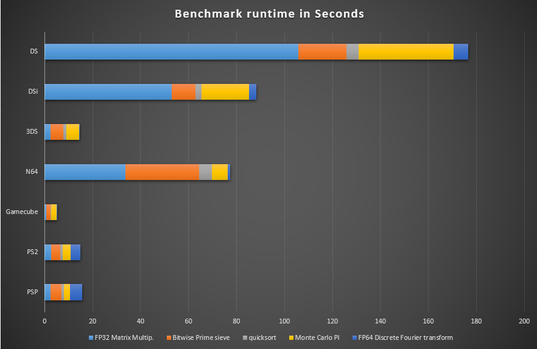

# Console Performance Benchmarking

This repository contains code and results from my attempt to benchmark various gaming consoles to test their performance across different workloads. The benchmarks are simple and focus solely on the main CPU core of each console, avoiding any SIMD or specialized processing extensions. This approach gives a straightforward comparison of raw core performance across different gaming platforms.

## Overview

Gaming consoles are typically optimized for real-time, graphics-intensive workloads, but CPU performance varies widely depending on the hardware generation and architecture. This project aims to measure CPU capabilities in isolation, excluding GPU, SIMD extensions, and other accelerators. 

The benchmarks focus on the following types of workloads:

1. **Matrix Multiplication**: Tests FP32 matrix multiplications, which represent parts of linear algebra calculations used in physics or graphics.
2. **Quicksort Algorithm**: Evaluates performance using the quicksort algorithm, a common task for sorting integers, which simulates workloads in data organization and game state management.
3. **Prime Number Sieve**: Uses the Sieve of Eratosthenes to measure integer processing capabilities in handling high-throughput, iterative tasks.
4. **Monte Carlo Pi Calculation**: Estimates the value of π using a Monte Carlo method, simulating a workload that involves random number generation and floating-point arithmetic. This is a common method for statistical calculations and scientific simulations.
5. **Discrete Fourier Transformation (DFT)**: Benchmarks FP64 CPU performance in handling signal processing tasks by transforming time-domain data into the frequency domain, which is useful for applications like audio processing and procedural generation.

## Limitations

- **No SIMD Extensions**: The benchmarks intentionally avoid SIMD extensions (e.g., NEON, AVX) to focus on the performance of a single main core. This restriction simplifies the code but limits comparison to raw core efficiency.
- **Single Core Only**: Each test is performed using a single CPU core to avoid the influence of multi-core scaling differences.
- **Basic Benchmarks**: These benchmarks do not attempt to mimic game-like scenarios. They are designed as synthetic workloads to isolate CPU characteristics in isolation.

## Getting Started

The code is designed to be as cross-platform as possible. To run the benchmarks on a console, you will need:
- A way to compile and run C code on your target console.
- A command line interface (CLI) or terminal access on the device, where possible.

### Running the Benchmarks

1. **Clone the Repository**:
   ```bash
   git clone https://github.com/yourusername/console-performance-benchmark
   cd console-performance-benchmark

## Results
The benchmarks were run on emulators representing different gaming consoles, with each test measuring the time taken by each workload in seconds. The following chart visualizes the performance across various consoles (emulated environments), giving insight into the relative strengths and weaknesses of each platform's CPU core.


| Console  | FP32 Matrix Multip. | Bitwise Prime sieve | quicksort | Monte Carlo PI | FP64 Discrete Fourier transform |
| -------- | ------------------- | ------------------- | --------- | -------------- | ------------------------------- |
| PSP      | 2.376328            | 4.605509            | 1.0673    | 2.420361       | 5.210301                        |
| PS2      | 2.693227            | 3.832727            | 0.965922  | 3.323292       | 3.989804                        |
| Gamecube | 0.761466            | 1.600666            | 0.445144  | 2.193801       | 0.052827                        |
| N64      | 33.797422           | 30.539562           | 5.406517  | 6.507912       | 1.086304                        |
| 3DS      | 2.327               | 5.533               | 1.296     | 5.185          | 0.093                           |
| DSi      | 52.87058            | 10.024085           | 2.534641  | 19.717388      | 3.09211                         |
| DS       | 105.810158          | 20.0612             | 5.072587  | 39.460449      | 6.188239                        |
